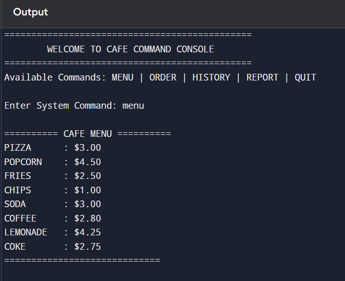
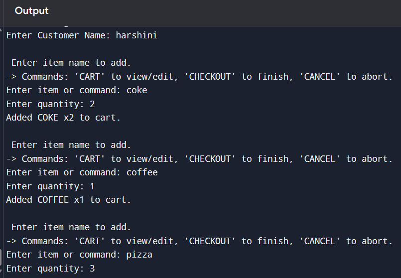

# ☕ Cafe Management System

A command-line based **Cafe Management System** developed in **Python** using **Object-Oriented Programming (OOP)** principles. This application allows users to browse the menu, place orders, manage their cart, apply coupon codes, generate receipts, and view sales reports.

---
## 🚀 Features

- Command-driven interface (`MENU`, `ORDER`, `HISTORY`, `REPORT`, `QUIT`)
- Interactive cart management (Update, Remove, Clear)
- Input validation for user-friendly operation
- Coupon code support with automatic discount calculation
- GST calculation on the discounted subtotal
- Timestamped receipt generation saved as `.txt` files
- Order history and daily sales reports
- Object-Oriented Programming (OOP) implementation

---
## 🛠️ Tech Stack

- Python 3
- Object-Oriented Programming (OOP)
- File Handling
- Exception Handling
- Dictionaries
- Functions
- Loops
- `random`
- `datetime`

---
## 📸 Screenshots

### 🍽️ Menu


### 🛒 Cart


### 🧾 Receipt


### ❌ Remove Option


### 📊 Sales Report


---
## ▶️ Getting Started

### Prerequisites

- Python 3.7 or later

### Installation

```bash
git clone https://github.com/Harshini-ambati/Cafe-management-system.git
cd Cafe-management-system
```

### Run the Application

```bash
 Cafe management system
```

---
## 📖 Usage

After running the program, the following commands are available:

| Command | Description |
|---------|-------------|
| `MENU` | Display the café menu |
| `ORDER` | Start a new order |
| `HISTORY` | View completed orders |
| `REPORT` | View daily sales report |
| `QUIT` | Exit the application |

### 🛒 Placing an Order

1. Enter the customer name (leave blank for **Guest**).
2. Add food items to the cart.
3. Use cart commands:
   - `CART` – View/Edit cart
   - `CHECKOUT` – Complete the order
   - `CANCEL` – Cancel the order
4. Apply a coupon code (optional).
5. View the generated receipt.

---
## 🎟️ Available Coupon Codes

| Coupon Code | Discount |
|-------------|----------|
| `TREAT26` | 20% |
| `WELCOME10` | 10% |

Each completed order generates a receipt file:

```text
receipt_<order_id>.txt
```

---

## 📂 Project Structure
```text
Cafe-management-system/
── screenshots/
 ─ menu.png
 ─ cart.png
 ─ receipt.png
 ─ remove_option.png
 ─ sales_report.png
── cafe_management_system.py
── README.md
── LICENSE
── .gitignore
```

---
## 🔮 Future Improvements

- Database integration for permanent order storage
- Staff login and authentication
- GUI using Tkinter
- Inventory management
- Search and filter menu items
- Coupon expiry dates and usage limits

---
## 👩‍💻 Author

**Harshini Ambati**

**B.Tech Student | Artificial Intelligence & Machine Learning (AI & ML)**

This is my first personal Python project. I built this Cafe Management System to strengthen my understanding of Object-Oriented Programming (OOP), dictionaries, functions, loops, file handling, exception handling, and input validation while learning how to organize code using classes and methods.

GitHub: https://github.com/Harshini-ambati

---
## 📄 License

This project is licensed under the **MIT License**.

---

⭐ If you found this project useful, consider giving it a **Star** on GitHub!
